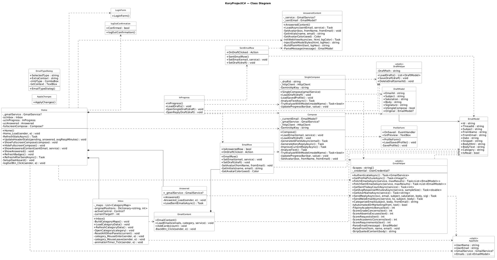

<p align="center">
  <br/>
  <em>AI-Powered Academic Email Assistant for Educators and Students</em>
</p>
<p align="center">
  
  
  
  
</p>

---

## What is Kory?

Kory is a desktop email management tool built specifically for academic professionals: professors, instructors, and students who deal with a high volume of emails daily. Instead of drowning in an unorganized inbox, Kory automatically sorts incoming emails by academic category, surfaces what matters most, and gives you AI tools to draft replies faster and better.

The name **Kory** is inspired by the Filipino word koreo, which means “mail". Kory is a playful cat you'll meet throughout the app — a little paw-print companion guiding you through your inbox.

---

## UML Diagram


## Features

**Smart Inbox Categorization**
Emails are automatically sorted into six academic categories upon arrival — no manual tagging required.

| Category | Color |
|---|---|
| Grade Concerns | $\color{red}{Red}$ |
| Absents / Excuses | $\color{purple}{Purple}$ |
| Requests | $\color{blue}{Blue}$ |
| Academic Concerns | $\color{green}{Green}$ |
| Requirements | $\color{pink}{Pink}$ |
| Non-Academic | $\color{gold}{Gold}$ |

**AI Writing Tools (powered by Gemini)**
- **Kory Reply** — generates a full reply draft based on the email context
- **Improve** — polishes your existing draft while keeping your voice
- **Analyze** — scores your email on Clarity, Tone, and Professionalism (0–100 each)

**Email Workflow**
- Reply to student emails with full thread context (original email on the left, your reply on the right)
- Compose new emails from scratch
- Save drafts and resume them later from the In Progress tab
- Track what you've sent today from the Answered tab

**Dashboard**
- Live stats: pending unread emails, emails answered today, and your sending rate per hour
- Profile card greeting with your Google account picture

**Profile & Signature Builder**
Set your name, title, department, and preferred closing phrase. Kory auto-fills your signature every time you compose.

**Secure Google Sign-In**
OAuth2 login — Kory never stores your password. Logging out clears the local token automatically.

---

## Tech Stack

| Layer | Technology |
|---|---|
| Language | C# (.NET 8) |
| UI Framework | WinForms + Guna UI2 |
| Email | Gmail API (Google.Apis.Gmail.v1) |
| AI | Google Gemini (gemini-2.5-flash / gemini-2.0-flash) |
| Browser in App | Microsoft WebView2 |
| Auth | Google OAuth2 |

---

## Getting Started

**Requirements**
- Windows 10 or later
- Visual Studio 2022 with .NET Desktop Development workload
- A Google account (school or personal)
- Gemini API key (free tier works)

**Setup**

1. Clone the repository and open `KoryProjectC#.sln` in Visual Studio 2022.

2. Place your `credentials.json` (downloaded from Google Cloud Console) in the project root. The app uses this to authenticate with Gmail.

3. Create a file named `apikeys.txt` in the same directory and paste your Gemini API key inside — just the key, nothing else.

4. Build and run in **Release** mode. Accept any firewall prompts on first launch.

5. Click **Connect with Google** and sign in. Kory will fetch your inbox and you're ready to go.

> **Note:** The Gmail OAuth scope requested is `gmail.modify` + `gmail.send`. Kory reads your inbox and sends replies on your behalf — nothing is stored remotely.

---

## Project Structure

```
KoryProjectC#/
├── GmailHelper.cs          # Gmail API calls + smart email categorizer
├── Home.cs                 # Main window and navigation
├── Inbox.cs                # Category card grid view
├── Compose.cs              # Reply composer with AI tools
├── SingleCompose.cs        # Fresh compose window
├── Answered.cs / .cs       # Sent email history
├── InProgress.cs           # Draft management
├── ProfileForm.cs          # Signature builder
├── DraftHelper.cs          # Local draft save/load (JSON)
├── EmailModel.cs           # Email data model
├── AppState.cs             # Global session state
└── Resources/              # Icons, images, mascot assets
```

---

## The Team — Wing Bytes

<table>
<tr>
    <th> &nbsp; </th>
    <th> Name </th>
    <th> Role </th>
</tr>
<tr>
    <td> </td>
    <td><strong>Gadiel Gospel L. Manalo</strong> <br/>
    <a href="https://github.com/manalogadiel" target="_blank">
    
        </a>
    </td>
    <td>Developer, UI/UX Designer</td>
</tr>
<tr>
    <td> </td>
    <td><strong>Sebastian Miguel Bueno</strong> <br/>
    <a href="https://github.com/yyytsaB" target="_blank">
    
        </a>
    </td>
    <td>Developer, Debugger</td>
</tr>
<tr>
    <td> </td>
    <td><strong>Kurt Andrei Villena</strong> <br/>
    <a href="https://github.com/andreiiiizz" target="_blank">
    
        </a>
    </td>
    <td>Developer, API Integration</td>
</tr>
</table>

---
## Known Limitations

- Sent email history in the Answered tab only shows emails sent **today** (resets at midnight).
- Drafts are stored locally as JSON — they do not sync across machines.
- The Gemini API key must be present for AI features to work; the app runs without it but those buttons will silently fail.
- Categorization is keyword-based and works best with emails written in English or Filipino academic style.

---
 ## Acknowledgements
 - Ma'am Fatima
 - Pao na nagdala ng ulam
<p align="center"><sub>Built with too much coffee and just the right amount of cat energy ☕🐾</sub></p>
